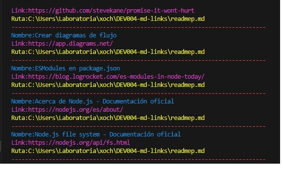
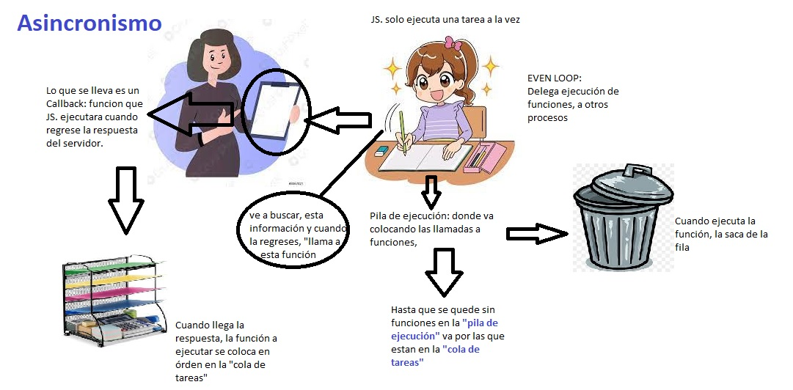

### 1.- MdLinks**       

Markdown es un lenguaje de marcado que facilita la aplicación de formato a un texto empleando una serie de caracteres de una forma especial. En principio, fue pensado para elaborar textos cuyo destino iba a ser la web con más rapidez y sencillez que si estuviésemos empleando directamente HTML. Y si bien ese suele ser el mejor uso que podemos darle, también podemos emplearlo para cualquier tipo de texto, independientemente de cual vaya a ser su destino. (1)

### 2.- Descripción del proyecto** 
Node.js es un entorno de ejecución para JavaScript, lo que permite ejecutar JavaScript en el entorno del sistema operativo, de esta forma podemos interactuar con el sistema.

En MdLinks se construyó un programa que se ejecuta usando Node.js, esta conformado por una línea de comando **(CLI)** asi como una libreria propia de JS.

El diseño de una *libreria propia*  es una gran experiencia pues logra que el desarrollador piense en la interfaz **(API)** y cómo podría ser usado por otros desarrolladores. 

### 3.- Tabla de contenido** 

- [1.- MdLinks\*\*](#1--mdlinks)
- [2.- Descripción del proyecto\*\*](#2--descripción-del-proyecto)
- [3.- Tabla de contenido\*\*](#3--tabla-de-contenido)
- [4.- Cómo ejecutar el proyecto](#4--cómo-ejecutar-el-proyecto)
- [5.- Cómo utilizar el proyecto](#5--cómo-utilizar-el-proyecto)
- [6. Prueba en consola](#6-prueba-en-consola)
- [7.- Referencias utilizadas](#7--referencias-utilizadas)
- [8.- Crédito](#8--crédito)

### 4.- Cómo ejecutar el proyecto

Para acceder se debe importar con require('sgcm14-mdlinks').
gcm14-mdlinks es un CLI que verifica los links que contienen archivos.md, reporta estadísticas de los links y si estan rotos.

*$ npm install sgcm14-mdlinks*

### 5.- Cómo utilizar el proyecto

API

Contiene la función mdLinks y las siguientes opciones

*1.- Validate:false* 

href: URL encontrada.
text: Texto que aparecía dentro del link (<a>).
file: Ruta del archivo donde se encontró el link.

*2.-Validate:true*

href: URL encontrada.
text: Texto que aparecía dentro del link (<a>).
file: Ruta del archivo donde se encontró el link.
status: Código de respuesta HTTP.
statusText: Mensaje fail,Not Found,Internal Server Error,Bad Request,Forbidden,etc en caso de fallo u ok,No Content,etc en caso de éxito. 

**Diagrama de flujo**

CLI

Tiene los parámetros

path-to-file: Ruta absoluta o relativa al archivo o directorio.

options: pueden ser

**--validate:** el módulo hace una petición HTTP para averiguar si el link funciona o no. Si el link resulta en una redirección a una URL que responde ok, entonces consideraremos el link como ok.
**--stats:** el output (salida) será un texto con estadísticas básicas sobre los links. (total y unique)
**--validate --stats:** para obtener estadísticas que necesiten de los resultados de la validación. (total, unique y broken)

**Diagrama de flujo**

### 6. Prueba en consola

El siguiente es un ejemplo de cómo ejecutarlo.

 *node cli.js readmep.md*
   

 *node cli.js readmep.md --validate*
  

 *node cli.js readmep.md --stats*
  

  *node cli.js readmep.md --validate --stats*
  

### 7.- Referencias utilizadas

👉(1) Markdown qué es: https://www.genbeta.com/guia-de-inicio/que-es-markdown-para-que-sirve-y-como-usarlo
👉(2) ¿Qué es NODE?: https://www.youtube.com/watch?v=9U8EaVjuq6U&t=78s
👉(3) Promesas: https://www.youtube.com/watch?v=pHBmmbDQl0o&t=280s
👉(4) Asincronismo, elaborado por Xóchitl: 

### 8.- Crédito

Elaborado por Xóchitl Luna Jara, con apoyo de los couches Jorge, Génesis y en la contención y apoyo emocional Araceli.

lunajarax@gmail.com
https://www.linkedin.com/in/xochluja/
https://github.com/Xoch09

